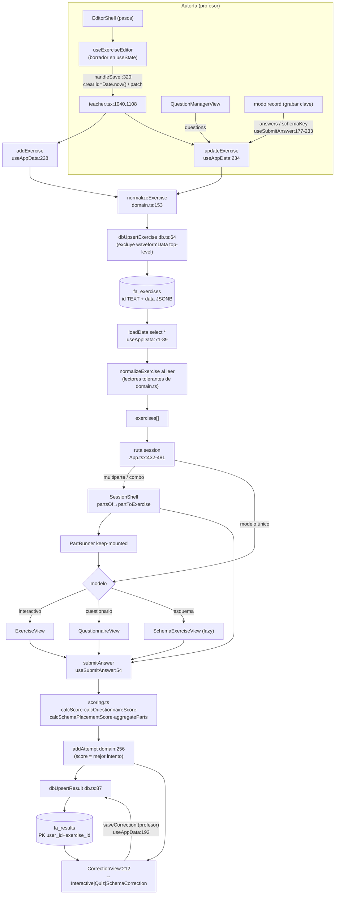

# A2 — Arquitectura y flujo de datos

**Fecha:** 2026-07-09
**Rama:** `beta`
**Commit HEAD analizado:** `f263089a1ef0e70f2fb2902839e891cca6afe52a` (`f263089`) — mismo que A0/A1.
**Método:** exploración con 5 agentes de lectura en paralelo (enrutado, estado, capas, monolitos, flujo del ejercicio); los dos hallazgos de severidad alta fueron re-verificados manualmente línea a línea antes de registrarse.

---

## 1. Arranque y enrutado

### 1.1 Cadena de arranque

1. `src/main.tsx:18-22` — `createRoot(#root)` → `<StrictMode><App/></StrictMode>`; fuentes autoalojadas vía `@fontsource` (`main.tsx:7-16`).
2. `src/App.tsx:82-87` — `LOCAL_MODE`: `?local` / `?local=alumno` **solo en `vite dev`** (`import.meta.env.DEV` es constante de build → eliminado de producción); semilla en memoria y sesión ya iniciada, cliente Supabase nulo → escrituras no-op (`src/hooks/useAppData.ts:60-62`).
3. `src/App.tsx:95-97` — estado de sesión `user` (solo memoria; ver hallazgo A2-06).
4. `src/App.tsx:103-116` — `useAppData(...)`: entidades + CRUD + `dbReady`/`serverHasAdmin`/`saveError`.
5. `src/App.tsx:119` + `src/lib/routing.ts:159-188` — `useHashRoute()`: **la URL hash es la fuente de verdad de navegación**.
6. `src/App.tsx:184-189` → `bootstrap` (`useAppData.ts:115-138`): detección de magic-link (sesiones cuyo email no acaba en `@fa.local` → `resetSession`), `loadData` anónimo (RLS devuelve poco/nada), RPC `has_admin`; `finally → setDbReady(true)`.

**Gates de render, en orden** (cuerpo de `App`): `!dbReady` → "Cargando…" (`App.tsx:295-301`) · `serverHasAdmin === false` → `SetupView` (`:303-307`) · `pick-teacher` + student → `TeacherPickerView` (`:310-320`) · `!user` → flujo de login con prioridades resetSession/pendingLoginUser/showForgotPin/loginRole/HomeView (`:323-416`) · autenticado → bloques por `route.name` y rol (`:432-634`).

`completeLogin` (`App.tsx:264-282`): recarga `loadData` con sesión y consume `redirectAfterLogin` solo si el destino coincide con el prefijo del rol.

### 1.2 Tabla de rutas

Parsing en `routeFromSegments` (`src/lib/routing.ts:70-128`); las query strings (`?parte=`, `?tipo=`, `?estado=`, `?todos=`, `?paso=`) son transparentes al parsing (`routing.ts:31-39`) y se gestionan con `parseHashQuery`/`setHashQuery` (`:45-67`).

| Ruta (hash) | Componente | Rol | Decisión |
|---|---|---|---|
| `#/` | `HomeView` (o panel del rol con sesión) | anónimo | App.tsx:410-415 |
| `#/configuracion` | **ninguno** — ruta muerta (A2-04) | — | App.tsx:220 (único uso) |
| `#/entrar/profesor` · `#/entrar/alumno` | `LoginView` | anónimo | App.tsx:381-409 |
| `#/alumno` (+ `/cursos/:c?/:u?`) | `StudentDash` (→ `CoursesPages`) | alumno | App.tsx:548-574 |
| `#/alumno/elegir-profesor` | `TeacherPickerView` | alumno con sesión | App.tsx:310-320 |
| `#/alumno/ejercicio/:exId` | sesión (SessionShell / vista por modelo) | ambos | App.tsx:432-481 |
| `#/alumno/ejercicio/:exId/correccion` | `CorrectionView` | autenticados | App.tsx:515-545 |
| `#/profesor` (tab exercises) | `TeacherDash → ExercisesTab` | profesor/admin | teacher.tsx:1223 |
| `#/profesor/cursos/:c?/:u?` | `TeacherDash → CoursesTab` | profesor/admin | teacher.tsx:1235-1260 |
| `#/profesor/alumnos` | `TeacherDash → StudentsTab` | profesor/admin | teacher.tsx:1262-1273 |
| `#/profesor/audios` | `TeacherDash → AudiosTab` | profesor/admin | teacher.tsx:1275-1293 |
| `#/profesor/ajustes` | Categories+Settings+Users(admin) | profesor/admin | teacher.tsx:1297-1321 |
| `#/profesor/categorias` · `#/profesor/usuarios` | **página vacía** (A2-03) | — | sin bloque en teacher.tsx:1223-1321 |
| `#/profesor/alumnos/:sId/ejercicio/:exId` | `CorrectionView` isTeacherMode + cola | profesor/admin | teacher.tsx:1049-1076 |
| `#/profesor/ejercicio/nuevo` · `/:exId` | `EditorShell` (crear/editar) | profesor/admin | teacher.tsx:1079-1120 |
| `#/profesor/ejercicio/:exId/grabar` (`?parte=`) | vista de sesión en modo record | profesor/admin | App.tsx:432-481 (guard :435) |
| `#/profesor/ejercicio/:exId/previsualizar` | vista de sesión en modo preview | profesor/admin | ídem |
| `#/profesor/ejercicio/:exId/preguntas` | `QuestionManagerView` | profesor/admin | App.tsx:484-512 (guard :485) |
| `#/profesor/ejercicio/:exId/correccion` | `CorrectionView` (preview efímero) | profesor/admin | App.tsx:515-545 |
| desconocidas | fallback silencioso a exercises/home | — | routing.ts:124,127 (A2-24) |

### 1.3 Protección de rutas

**Todo el gating de UI es exclusivamente de cliente; la protección real de datos es RLS en Supabase** (verificado: la carga anónima del montaje viene vacía por RLS y se recarga tras login, `App.tsx:267-272`; escrituras rechazadas emergen en `SaveErrorToast`, `App.tsx:57-72`).

- Guards explícitos con redirect: alumno en record/preview → `/alumno` (`App.tsx:435`); alumno en gestor de preguntas → `/alumno` (`:485`); no-admin en `/profesor/usuarios` → `/profesor` (`:577-580`).
- Guards implícitos por orden de bloques: alumno en `#/profesor` ve su StudentDash con la URL intacta (nunca se monta TeacherDash, que además es chunk lazy que ni descarga, `App.tsx:46`); simétrico para profesor en `#/alumno` (A2-22).
- Setup solo si el **servidor** confirma que no hay admin (RPC `has_admin`), no manipulable navegando.
- Sin guard inverso en sesión: un profesor puede abrir `#/alumno/ejercicio/:id` y entregar como si fuera alumno; se guarda como resultado real bajo su id en `fa_results` (INFO, no contamina a alumnos).

### 1.4 Árbol de vistas

```
main.tsx (createRoot)
└─ App (App.tsx) — sesión + routing + submit; datos en useAppData; entrega en useSubmitAnswer
   ├─ [gate] "Cargando…" · SetupView · TeacherPickerView
   ├─ [sin sesión] ResetPinView · RecoveryEmailModal · ForgotPinView · LoginView · HomeView   (auth.tsx)
   ├─ [session]
   │   ├─ SessionShell (multiparte alumno / combo de modelos)          SessionShell.tsx:141
   │   │   └─ PartRunner (keep-mounted por modelo; LRU-1 por parte)    SessionShell.tsx:83-139
   │   │       ├─ ExerciseView (interactivo)
   │   │       ├─ QuestionnaireView (cuestionario)
   │   │       └─ SchemaExerciseView (esquema, lazy)
   │   └─ (modelo único) ExerciseView | QuestionnaireView | SchemaExerciseView
   ├─ [question-manager] QuestionManagerView (lazy)
   ├─ [correction] CorrectionView → MultiPartCorrectionShell | CorrectionViewSingle
   │                                → InteractiveCorrection | QuizCorrection | SchemaCorrection  (correccion/)
   ├─ [alumno] StudentDash → CoursesPages · "Todos los ejercicios" (ExerciseItem) · PaletteMenuButton
   └─ [profesor/admin] TeacherDash (lazy, teacher.tsx:920)
       ├─ viewingAnswer → CorrectionView isTeacherMode + cola de pendientes
       ├─ detailExId → EditorShell (editor de pasos: components/editor/)
       ├─ tabs: ExercisesTab · CoursesTab (courses.tsx) · StudentsTab · AudiosTab · Ajustes
       └─ 9 modales (modals.tsx) + banner de entregas pendientes
```

---

## 2. Gestión de estado

### 2.1 Sin contexts, todo por props

`grep -rn "createContext|useContext" src/` → **0 resultados**; tampoco `useReducer`, `useSyncExternalStore` ni librería de estado externa. Todo el estado global vive en `useState` en `App` + `useAppData` y baja exclusivamente por props. La única fuente externa es la URL hash.

### 2.2 Estado raíz

**App.tsx** (sesión/routing/submit): `user` (:95), `route/navigate` (:119), `lastResult` (:159, reconstruible desde `results`), `redirectAfterLogin` (:160), `pendingLoginUser`/`showForgotPin`/`resetSession` (:162-166). Derivados con useMemo: `routeExercise`/`userResults`/`freshExercise` (:169-174, 420, 215).

**hooks/useAppData.ts** (capa de datos): `exercises` (:31), `users` (:33), `results` `{userId: {exerciseId: result}}` (:34), `categories`/`courses`/`units`/`groups` (:35-38), `audioLibrary` (:39), `dbReady`/`saveError`/`serverHasAdmin` (:41-45), `pendingSavesRef` (:29, guard beforeunload :141-150), ~30 helpers CRUD con patrón uniforme "setState optimista + dbUpsert*/dbDelete*" (:163-372), `loadData`/`bootstrap` (:71-138). Frontera sesión↔datos: `onCurrentUserSync` (:184-189).

### 2.3 Prop drilling

`TeacherDash` recibe **~45 props** (`App.tsx:586-631` → firma `teacher.tsx:920-937`); `StudentDash` ~16. Cadenas más profundas documentadas:

| Cadena | Niveles | Ruta |
|---|---|---|
| `results` (alumno→tarjeta móvil) | 7 | App:557 → StudentDash:149 → courses:649 → :631 → :601 → :289 (`ExerciseItem`) |
| `onUpdateExercise` como `onToggleVisibility` | 8 | useAppData:234 → App:593 → teacher:1251 → courses:661 → :649 → :639 → :601 → ExerciseItem:245 |
| `exercise` (sesión multiparte) | 5 con transformación por eslabón | App:442 → SessionShell:154 (`partToExercise`) → :269 → :118 → ExerciseView:56 |
| `categories` (→ paso Categorías) | 5 + hook | App:617 → teacher:1111 → EditorShell:69 → objeto `ed` → PasoCategorias:17 |

Funciona porque hay una sola pantalla por rol y cero contexts; el coste es que cada entidad nueva añade 3-4 props a la firma de TeacherDash (INFO — si crece, agrupar callbacks por dominio u introducir un context de datos, sin tocar la persistencia).

### 2.4 Estado duplicado / copias prop→estado

- **Snapshot de formulario del editor** (`useExerciseEditor.ts:39-103`): ~18 useState copian `exercise` al montar y nunca se resincronizan — patrón de borrador deliberado que **depende de remontaje**, y `EditorShell` se monta **sin `key`** (A2-05).
- **Espejo bidireccional de borradores** en sesión (keep-mounted M4.1, intencional y documentado): `SessionShell` guarda `drafts[partId][modelId]` (:150) y cada vista mantiene su copia local elevada con `useEffect(onDraftChange)` (`ExerciseView.tsx:81+125`, `QuestionnaireView.tsx:45+102`, `useSchemaEditor.ts:41-43`). Mayor superficie de des-sincronización del repo, hoy sin bug conocido.
- Resets incompletos y remontajes por key frágiles: A2-19, A2-20.
- **Persistencia**: URL hash (ruta + filtros `?tipo/?estado/?todos/?paso/?parte`); localStorage `fa_hint_seen_*` (`primitives.tsx:299-308`) y token de sesión Supabase (implícito, `supabase.ts:14`); sessionStorage `fa-inbox-dismissed` (`teacher.tsx:1005-1010`); variable de módulo `lastPanelPath` (`routing.ts:150-156`, A2-21).

---

## 3. Límites de capas

### 3.1 Acceso a Supabase — frontera intacta

| Fichero | Uso | Clasificación |
|---|---|---|
| `src/supabase.ts:14` | `createClient` (URL/key de `VITE_*` con fallback hardcodeado :9-11) | único creador del cliente |
| `src/data/db.ts` | `.from("fa_*").upsert/delete` (:67-98) sobre cliente **inyectado** (`getClient`, :18); factory `createDb` con DI completa (:37); retry 1s/3s/9s (:35-62) | capa de escritura |
| `src/hooks/useAppData.ts` | 8× `.select("*")` (:73-80), `.rpc("has_admin")` (:132), `auth.getSession` (:124); instancia `createDb` (:59-65) | capa de datos React |
| `src/auth/authClient.ts` | fetch a 5 Edge Functions (:38-138); `auth.getSession/setSession/signOut` | fachada de auth |
| `src/App.tsx` | composition root; pasa el cliente a bootstrap/loadData; 2 `signOut` directos (:332,337 — higiene, A2-25) | root |

**Ningún componente UI importa el cliente ni hace `.from()`/`.rpc()`. No hay `supabase.storage` ni realtime en todo `src/`.** `db.ts` no tiene consumidores fuera de `useAppData` (y `useSubmitAnswer` recibe `dbUpsertResult` inyectado, solo importa el tipo).

### 3.2 Pureza de `src/lib` (17 módulos)

**13/17 puros** (a11y, color, domain*, figures, harmony, modelMeta, palette, repeats, schema, scoring, sessionConstants, time, types). **4 impuros:**

| Módulo | Impureza |
|---|---|
| `routing.ts` | importa React (hooks `useState/useEffect/useMemo`, :28) + `window.location`/`history` (:32-182) — A2-10 |
| `audio.ts` | `fetch(url)` en `fetchAudioBuffer` (:76) — A2-11 |
| `ids.ts` | `uid()` con `Date.now()`+`Math.random()` sin inyección (:9) — A2-12 |
| `pointer.ts` | listeners globales en `window` (:21-32) — utilidad DOM deliberada (A2-27) |

*`domain.ts` es puro en efectos pero importa `../seed.js` (:5, `DEFAULT_CATEGORY`) — inversión de capa lib→app (A2-13).

### 3.3 Hooks y semillas

`useAppData` (datos+red; también toca `history.replaceState` y `beforeunload`, :125,148 — INFO), `useSubmitAnswer` (orquestación con DI correcta), `useAudioPlayer` (Web Audio + fetch de audio), `useIsMobile`/`useSchemaEditor`/`useSchemaZoom` (UI puros). `useExerciseEditor` genera ids con `Date.now()` a pelo en vez de `uid()` (:121,141,156,336 — dos convenciones conviviendo).

Modo `?local`: funcionalmente bien aislado (`import.meta.env.DEV` constante + `getClient → null`), pero los datos de `localSeed.ts` viajan al bundle de producción como peso muerto porque `useAppData` los usa en ternarios runtime (:32-38); solo el WAV se elimina por DCE (A2-26).

---

## 4. Autopsia de los monolitos

### 4.1 `SchemaExerciseView.tsx` (1859 líneas) — mapa de responsabilidades

Un único componente exportado (no hay sub-componentes top-level). La cabecera del fichero (:1-14) documenta el troceo previo (F7/T7.1: 2087→1859) y **por qué `SchemaTimeline` no se extrajo**: la física de arrastre está tejida vía `dragRef`/`trackSegRefs`.

**Inventario de hooks:** 13 `useState` (selección de repetición :76, guías de snap :77, reps locales :78, modal :79, vez seleccionada :81, guía de resize :83, playCount/marcas listen-only :88-89, viewMode :102, paleta :118-119, rulerW :163, waveform local :59) · 11 `useRef` (destacan `trackSegRefs` :158 — mapa DOM de todas las celdas pista/regla — y `dragRef` :159 — estado mutable del drag; patrón dominante: refs-espejo para que los listeners globales no tengan clausuras viejas) · 5 `useEffect` (click-fuera de paleta :121, resync 2ª vez :148, ResizeObserver :165, teclado Delete :283, y el **motor de drag :526-742**, 216 líneas de listeners globales con ramas create/move/resize/borde-compartido/snap/cascada) · 2 `useMemo` (`segments` :129, `activeRepeatPass` :139) · 0 `useCallback` · 3 hooks custom (`useAudioPlayer` :63, `useSchemaZoom` :94, `useSchemaEditor` :107).

**15 responsabilidades identificadas** (estados+handlers+efectos por tema, líneas en el informe del agente, resumen):

1. Reproducción de audio y transporte (:59-73, 1199-1265)
2. Zoom/scroll horizontal (`useSchemaZoom`, wrapper :1304-1317, scrollbar :1688-1718)
3. Modo vista completa/resumida (:102-104, 129-153, 1229-1253 + condicionales por toda la vista)
4. Modelo de bloques historial/selección/etiquetas (delegado a `useSchemaEditor`; panel :1720-1824)
5. **Física de arrastre/creación/redimensionado** (:526-874 — el bloque declarado inseparable)
6. Repeticiones (modelo) (:76-84, 173-232, RepeatManagerModal/RepeatBand)
7. Resize de zona de repetición desde la regla (:306-386)
8. Navegación/seek por regla + playhead (:388-476, 1335-1536)
9. Mapeos tiempo↔posición (`recToVisX*`, `containerXToRec`, :234-277, 479-492)
10. Marcas listen-only (:87-91, 478-523, 1394-1412)
11. Paleta de colores (:118-127, 1267-1301)
12. Persistencia del draft (props :51-54 → `useSchemaEditor`)
13. Teclado (:283-304)
14. Touch transversal (pares mouse/touch duplicados, `passive:false`)
15. Entrega (`handleSubmit` :1176, StickyActionBar :1829-1856)

**Separable que sigue dentro** (constatación, sin diseñar): `renderSegBlocks` (:893-1174, función de render de 282 líneas con 3 variantes visuales de bloque), el subsistema listen-only completo, el selector de paleta, el resize de zonas de repetición, la regla de navegación con playhead/timestamps, las barras de vista resumida y el panel de selección/detalle. El motor de drag + iniciadores (:526-874) queda acoplado vía `dragRef`/`trackSegRefs` (corte descartado y documentado en cabecera).

### 4.2 Índices del resto de grandes

**`teacher.tsx` (1414):** 11 componentes — `ExercisesTab` (:40-187), `StudentsTab` (:189-383), `CategoriesTab` (:384-488), `AudioCard`/`BookCard` (internos, :489-588), `AudiosTab` (:589-752), `SettingsTab`/`SettingsSection`/`PalettePreferenceCard` (:754-805), `UsersTab` (:811-919) y **`TeacherDash`** (:920-1414, ~495 líneas): memos de students/teachers/groups, cola de correcciones + banner, **13 useState de modales/UI** (:1005-1033), 3 retornos tempranos de enrutado, cabecera con pestañas, dispatch de 5 tabs y montaje de **9 modales** (:1323-1410). El propio header (:4) tiene el `TODO: subdividir`.

**`session.tsx` (991):** 5 exports — `FragmentRangeSelector` (:23-347, handles arrastrables + `<audio>` propio + bucle rAF), `WaveformDisplay` (:400-761, React.memo, canvas rAF ~75fps, el grueso del fichero), `AudioScrubber` (:782-883, rAF sobre refs sin re-render), `FigureLabel` (:904-927), `FunctionButtons` (:929-990, React.memo). Patrón común: renderizado fuera de React (rAF + refs) para no repintar a cada tick de audio.

**`modals.tsx` (943):** 12 modales-formulario sobre `ModalShell`: CategoryEditor (:33), GroupEditor (:122), CourseForm (:171), UnitForm (:243), ExercisePicker (:274), AddUser (:322), ResetCredential (:404), RecoveryEmail (:465), AudioLibraryPicker (:515), AudioLibraryForm (:567, el mayor), BookForm (:704), QuestionEditor (:750-943).

**`primitives.tsx` (1177):** 44 componentes exportados en 10 categorías (infra de modal ×3 con trampa de foco, botones ×5, botones-icono ×5, iconos SVG ×6, inputs ×4, indicadores ×4, navegación/menús/filtros ×7, chrome de sesión ×3, tipografía ×4, audio/corrección ×3). Observación: `TeacherFilterBar`/`StudentFilterBar` (:944-1086) y el chrome de sesión son "composites de dominio" más que primitivas, conviviendo con iconos de 10 líneas.

### 4.3 Ciclo de imports A1-04 — causa raíz confirmada

`courses.tsx:12` importa `ExerciseItem`; `ExerciseItem.tsx:16` importa `KebabMenu`, que es un envoltorio genérico del primitivo `Menu` definido en `courses.tsx:302`. Tercer consumidor: `teacher.tsx:18`. **Salida natural: mover `KebabMenu` a `primitives.tsx`** (donde ya vive `Menu`) — rompe el ciclo sin tocar comportamiento.

---

## 5. Flujo de datos completo de un ejercicio

### 5.1 Creación (editor de pasos)

`EditorShell@EditorShell.tsx:68` → `useExerciseEditor@useExerciseEditor.ts:33` (borrador **solo en memoria**: recargar lo pierde; el paso activo persiste en `?paso=`, `EditorShell.tsx:75-81`) → `handleSave@:320` → `onCreate`/`onUpdate` → `handleExerciseCreated@teacher.tsx:1040` → `addExercise@useAppData.ts:228` / `updateExercise@:234`.

Objeto creado (`:334-355`): `{ id: Date.now()` **(número)**, `title, duration, model, models, audioUrl, audioName, waveformData, audioFragmentStart/End, audioTotalDuration, showHint, categories, answers:{}, questions:[], listenOnly/immediateSchemaFeedback/schemaLevels, showComposer, composerName }`. Las **claves** (`answers`, `schemaKey`, `questions`) NO las escribe el editor: se graban en modo record / gestor de preguntas. El tipo `Exercise` (`types.ts:82-114`) es deliberadamente permisivo (`[k: string]: unknown`).

### 5.2 Normalización y persistencia

`addExercise`/`updateExercise` → `normalizeExercise@domain.ts:153-159` (materializa `categories`/`models`/`questions`/`parts` en la frontera; idempotente) → `dbUpsertExercise@db.ts:64` → upsert `{id, data}` en `fa_exercises` (`id TEXT + data JSONB`, `0001_base_schema.sql:7`). Se excluye `waveformData` **solo de nivel superior** (`db.ts:66`) — pero no dentro de `parts` (A2-09). `audioUrl` SÍ se persiste. Reintento exponencial + `pendingSavesRef` + `onError` → `SaveErrorToast`.

### 5.3 Carga

`bootstrap` → `loadData@useAppData.ts:71` → `select("*")` de 8 tablas → `normalizeExercise` al leer (:89). **Tolerancia a datos históricos, toda en lectores** (cero migraciones): `mode`/`modes` legacy (`categoriesOf@domain.ts:31-36`), `answer` plano (`answerFor@:46-53`), sin `models` (`modelOf/modelsOf@:38-44`), sin `parts` → síntesis desde campos planos (`partsOf@:132-139` + `PART_FIELDS@:115-120`; el comentario :122-131 explica por qué **refresca** en vez de devolver la parte congelada), `scope` inferido (`questionScopeOf@:187-190`), resultados sin `attempts`/sobre/snapshot (`attemptsOf`, `resultPartsOf`, `questionsSnapshotOf`), `totalScore` 0-10→0-100 (`shared.ts:66-67`).

### 5.4 Render en sesión

Despacho en `App.tsx:432-481`: multiparte genuino de alumno → `SessionShell` con el ejercicio crudo (:440-443); record/preview de multiparte → proyección `partToExercise@domain.ts:166-171` de la parte `?parte=` (:453-457; con 1 parte NO se proyecta — comentario :444-452, el fix de 2026-07-06); paleta `applyPaletteToExercise` (:461-462); combo 2 modelos → `SessionShell` (:465-467); modelo único → `SchemaExerciseView` lazy / `QuestionnaireView` / `ExerciseView` (:470-480).

`SessionShell.tsx:141`: parte activa desde `?parte=` (:146-149), `PartRunner` keep-mounted por modelo (toggle por `display`, :135; LRU-1 por parte vía `key` :267-268), borradores `drafts[partId][modelId]` (:150,163-165), entrega final `finalize@:174-183` con `draftToPayload@:59-69` y guardia de partes incompletas (`isModelStarted@:46-55`).

### 5.5 Corrección y resultado

Payloads: interactivo `{entries:[{categoryId, intervals}], currentCategoryId}` (`ExerciseView.tsx:283-289`); cuestionario `{type, answers, score}` (`QuestionnaireView.tsx:106-109`); esquema `{type, blocks, mode, repetitions, schemaPalette}` (`SchemaExerciseView.tsx:1176`); multi `{type:"multi", parts.byModel}` (`SessionShell.tsx:174-183`).

`submitAnswer@useSubmitAnswer.ts:54`: puntúa con los puros de `lib/scoring.ts` — `calcScore@:27` (interactivo), `calcQuestionnaireScore@:68`, `calcSchemaPlacementScore@:85`, `aggregateParts@:319` (multi) — · `mode record` guarda la clave en el ejercicio (:177-186, 219-233) · `mode preview` no persiste · entregas de alumno pasan por `addAttempt@domain.ts:256-264` (score = mejor intento) y `resultStatusOf@:95-101` → `dbUpsertResult@db.ts:87-90` → `fa_results` (PK `user_id+exercise_id`; invitados `guest-*` no persisten) → navega a corrección → `CorrectionView.tsx:212-216` (multiparte `:66` / single `:27` → despacho por `result.type`). Corrección manual del profesor: `saveCorrection@useAppData.ts:192-218` → `dbUpsertResult`.

### 5.6 Diagrama



---

## 6. Hallazgos

Los dos altos fueron re-verificados manualmente sobre el código (no solo por agente).

### Altas

- **[A2-01] alta** — `src/components/ExerciseView.tsx:286` y `src/components/SessionShell.tsx:65` — evidencia (verificada): ambos submits serializan `ivs.map(({fn,start,end}) => ({fn,start,end}))`, **descartando `fig`** (cifrado/inversión) que la vista sí captura (`commitInterval@ExerciseView.tsx:147-149` y el selector de cifrado `:463`) y que la corrección sí evalúa (`interactiveFigureDiagnostics@scoring.ts:209-246`). Doble consecuencia: (a) una clave grabada desde la UI llega sin `fig` a `answers` → el diagnóstico de cifrado devuelve `null` siempre (guard `scoring.ts:215`); (b) con una clave que sí tiene `fig`, la respuesta del alumno pierde los suyos → todo instante evaluable cuenta como fallo (`kFig === sFig` compara contra `null`, `scoring.ts:234-241`). **La funcionalidad de evaluación de cifrado está efectivamente rota de extremo a extremo.** — Recomendación: incluir `fig` en ambos `map` de serialización (2 líneas).
- **[A2-02] alta** — `src/lib/domain.ts:132-139` + `src/components/editor/useExerciseEditor.ts:104,152-153,359-360` — evidencia (verificada): `removePart` permite reducir un multiparte genuino de 2→1 partes; con `isMultiPart = parts.length > 0` el guardado escribe `parts:[A]`; y `partsOf` con `length===1` **pisa todos los `PART_FIELDS` de esa parte con los campos planos del ejercicio** (obsoletos desde que se convirtió en multiparte) → el audio/clave/preguntas de la parte superviviente quedan enmascarados por datos viejos. Es la variante evidenciada del "pendiente más profundo" anotado el 2026-07-06. — Recomendación: al guardar con `parts.length===1`, aplanar la parte a los campos planos y eliminar `parts`.

### Medias

- **[A2-03] media** — `src/lib/routing.ts:120-124,131-135` + `src/components/teacher.tsx:1223-1321` — las rutas `#/profesor/categorias` y `#/profesor/usuarios` producen tabs que ningún bloque de TeacherDash renderiza desde que Categorías/Usuarios se anidaron en Ajustes: página vacía bajo la cabecera; `TEACHER_TAB_PATH` las sigue exponiendo y el guard de `App.tsx:577` trata `users` como pestaña real. — Mapear ambas a tab `settings` o redirigir, y podar `TEACHER_TAB_PATH`.
- **[A2-04] media** — `src/lib/routing.ts:73` + `src/App.tsx:220,306-307` — ruta muerta `#/configuracion`: parseada y documentada pero App nunca renderiza SetupView por ella; su único efecto real es contar como ruta "open". — Eliminarla o hacer que muestre SetupView cuando `noAdmin`.
- **[A2-05] media** — `src/components/teacher.tsx:1080-1118` + `useExerciseEditor.ts:39-103` — `EditorShell` se monta sin `key` y todo el formulario es snapshot-al-montar: una transición detalle→detalle sin desmontar (URL editada, historial) reutiliza la instancia y «Guardar» escribiría los datos del ejercicio A sobre el B. — `key={String(selectedExerciseId ?? "new")}` en ambos montajes.
- **[A2-06] media** — `src/App.tsx:95` + `useAppData.ts:121-126` + `authClient.ts:52` — la sesión de UI es solo memoria mientras supabase-js persiste el token en localStorage: al recargar, un usuario logueado vuelve a la pantalla de login con una sesión de servidor válida viva (bootstrap solo rehidrata sesiones de recuperación, no las `@fa.local`). — Rehidratar el perfil en bootstrap o hacer signOut explícito.
- **[A2-07] media** — `src/components/SessionShell.tsx:46-51,185-189` — en multiparte, un cuestionario con 0 preguntas nunca cuenta como "completo" (`qs.length > 0`) → `attemptFinalize` bloquea la entrega indefinidamente; el editor permite guardar y publicar así. — Tratar 0 preguntas como completo o bloquear la publicación.
- **[A2-08] media** — `useExerciseEditor.ts:308,154-159` + `PasoAudios.tsx:218-226` + `scoring.ts:41` — `canSave` omite la duración en multiparte y `addEmptyPart`/pegar-URL no fijan `duration`; en sesión la parte proyectada tiene `duration === undefined` y `calcScore` devuelve **0 en vez de null** (el bucle no ejecuta). — Decodificar duración al asignar URL a una parte y validar por parte al guardar.
- **[A2-09] media** — `src/data/db.ts:66` + `domain.ts:115-120,137` — el upsert solo excluye `waveformData` de nivel superior, pero `normalizeExercise` materializa `parts[0].waveformData` → el waveform (≥400 floats) **sí se persiste** en el JSONB dentro de `parts`, contra la intención documentada en `db.ts:65`. — Excluirlo también dentro de cada parte.
- **[A2-10] media** — `src/lib/routing.ts:28,164-182` — módulo de lib con React (hook `useHashRoute`) y `window.location/history`: mezcla parseo puro con efectos de navegador. — Dejar el parseo en lib y mover hook/navigate a `src/hooks`.
- **[A2-11] media** — `src/lib/audio.ts:76` — `fetch(url)` dentro de lib (`fetchAudioBuffer`): red en la capa pura; obliga a mock global en tests. — Mover a capa de IO o inyectar el fetcher.
- **[A2-12] media** — `src/lib/ids.ts:9` — `uid()` usa `Date.now()`+`Math.random()` sin inyección: no determinista para tests. — Aceptar `now`/`rand` opcionales.
- **[A2-13] media** — `src/lib/domain.ts:5` — lib importa `../seed.js` (`DEFAULT_CATEGORY`): dependencia invertida lib→app. — Mover la constante a lib y reexportar desde seed.

### Bajas

- **[A2-14] baja** — `useExerciseEditor.ts:336` (+ `useAppData.ts:244`, y `p${Date.now()}` en `:156`) — `id: Date.now()` numérico en `data.id` frente a columna `id TEXT`: toda comparación debe pasar por `String()` (tolerancia ya establecida); peligro latente para código nuevo con `===`. — Crear ids como string.
- **[A2-15] baja** — `useAppData.ts:234-238` — `updateExercise` normaliza dos veces y persiste desde el closure `exercises` (estado potencialmente obsoleto si dos updates coinciden); el propio fichero documenta bugs análogos (:193-198,255-262). — Derivar el objeto persistido una sola vez.
- **[A2-16] baja** — `App.tsx:440-442` vs `:461-462` — la rama multiparte del alumno no aplica `applyPaletteToExercise` (la de una parte sí): la paleta preferida no recolorea en multiparte. — Aplicarla también ahí.
- **[A2-17] baja** — `useSubmitAnswer.ts:102` + `domain.ts:95-101` — en el sobre `multi`, `status` se evalúa con todos los modelos del combo → un combo esquema+cuestionario deja también "pendiente" el cuestionario autocorregible (efecto cosmético en chips).
- **[A2-18] baja** — `domain.ts:31-36` + `useExerciseEditor.ts:348,373` — un ejercicio sin interactivo se guarda con `categories: []` pero `normalizeExercise` lo materializa como `[DEFAULT_CATEGORY]`: la intención "sin categorías" no es representable (sin efecto en corrección).
- **[A2-19] baja** — `teacher.tsx:1062` — `key={JSON.stringify(freshResult.teacherCorrection)}` serializa O(n) en cada render y remonta CorrectionView entera (audio incluido) tras cada guardado. — Key estable + sincronización explícita.
- **[A2-20] baja** — `ExerciseView.tsx:68,89,122` — el reset por `[exercise.id]` omite `currentCategoryId` y `localWaveformData`; si la vista sobrevive a un cambio de ejercicio quedan datos del anterior. — Completar el efecto o remontar con `key`.
- **[A2-21] baja** — `routing.ts:150-156,169-172` — `lastPanelPath` es variable de módulo mutada desde un efecto: estado global invisible para React y persistente entre montajes en tests. — Documentar como singleton o mover a sessionStorage.
- **[A2-22] baja** — `App.tsx:548,581` — con rol que no corresponde la URL no se normaliza (alumno en `#/profesor` ve StudentDash con URL de profesor): enlaces compartidos engañosos, sin fuga de datos. — `navigate` replace a la raíz del rol.
- **[A2-23] baja** — `App.tsx:435,485,577-580` — redirects de guard llamando `navigate()` durante la fase de render (StrictMode lo ejecuta dos veces); funciona por idempotencia pero lo robusto es `useEffect`.
- **[A2-24] baja** — `routing.ts:124,127` — fallbacks silenciosos: ruta desconocida → exercises/home sin aviso; no hay 404 de ruta (el NotFound solo cubre ejercicio inexistente, `App.tsx:424-429`).
- **[A2-25] baja** — higiene menor agrupada: `App.tsx:332,337` usa `supabase.auth.signOut()` directo existiendo `authClient.logout()`; prop muerto `supabaseSession` (`auth.tsx:28` + `App.tsx:329`); `labels.admin` inalcanzable (`App.tsx:382`); props `tab`/`onTab` muertas en StudentDash (`App.tsx:561-562` + `StudentDash.tsx:34-41`).
- **[A2-26] baja** — `useAppData.ts:32-38` — los datos de `localSeed.ts` quedan en el bundle de producción (ternarios runtime; solo el WAV se DCE-a): peso muerto y datos ficticios en el JS servido. — `import()` dinámico gateado por DEV.
- **[A2-27] baja** — `src/lib/pointer.ts:21-32` — listeners globales en `window`: utilidad DOM deliberada que rompe la regla "lib puro". — Reubicar junto a hooks o documentar la excepción.

### Notas informativas (sin severidad)

- Un profesor puede entregar por `#/alumno/ejercicio/:id` y persiste como resultado real bajo su id (el camino intencionado es `previsualizar`).
- `TeacherDash` concentra ~45 props; sostenible hoy, agrupable por dominio si crece.
- `teacher.tsx:1238` pasa `results={{}}` a `CoursesTab`: el progreso del profesor por unidad se calcula siempre vacío (coherente hoy, sorpresa futura).
- `supabase.ts:9-11` — fallback hardcodeado de URL/anon key (pública por diseño); puede enmascarar un `.env` mal configurado. Se retomará en A8.

---

## Cierre de fase

- ✅ Puntos de entrada, enrutado y árbol de vistas profesor/alumno documentados con archivo:línea.
- ✅ Gestión de estado: cero contexts confirmado, estado raíz inventariado, 4 cadenas de prop drilling ≥5 niveles trazadas, duplicaciones prop→estado catalogadas.
- ✅ Límites de capas: frontera Supabase intacta (ningún componente la salta); 13/17 módulos de lib puros, 4 impuros identificados.
- ✅ Autopsia de `SchemaExerciseView` (13 estados, 11 refs, 5 efectos, 15 responsabilidades con rangos de líneas) + índices de `teacher`/`session`/`modals`/`primitives`. Ciclo A1-04 con causa raíz confirmada (`KebabMenu`).
- ✅ Flujo completo del ejercicio trazado en 5 etapas con diagrama Mermaid; 10 riesgos de contrato evidenciados.
- ✅ Criterio de cierre: el documento localiza dónde vive cada responsabilidad (rutas → §1.2; estado → §2.2; datos → §3.1; UI por vista → §1.4 y §4; dominio/corrección → §5).

**Hallazgos de esta fase:** 2 altas (A2-01, A2-02 — ambas verificadas manualmente), 11 medias (A2-03…A2-13), 14 bajas (A2-14…A2-27). Lo más relevante para Jon: **la evaluación de cifrado está rota de extremo a extremo por 2 líneas de serialización (A2-01)** — es un bug funcional del producto, no deuda técnica.
